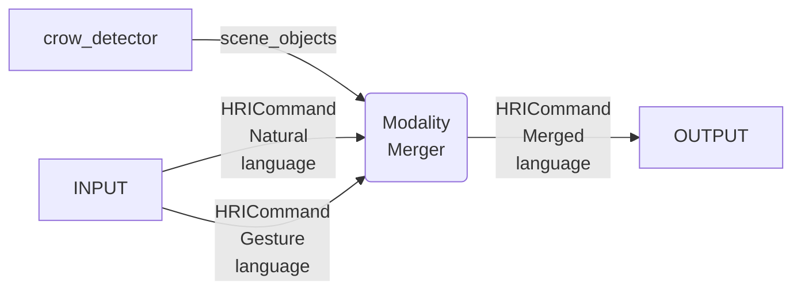

# imitrob_hri, on Modality Merger 2024 (MM24 branch)

This package consists of modality merger algorithm, NL processor for common imitrob setup, it is jointly working with crow-base modules.

## Merge modalities algorithm

See related [paper](http://imitrob.ciirc.cvut.cz/publications/mm24/).

### Connection to `crow`



### Install dependencies 

- Simulated setup, see deps for real setup below

```
pip install owlready nltk gTTS playsound SpeechRecognition rdflib knowl python-dotenv
```

### Artificial dataset usage

Dataset generation:
- Generate datasets with: `python data_creator2.py all` OR download datasets from [link](https://drive.google.com/file/d/1117fI_fFEZq8VNi0Fm3q_jKOTQEQSJOU/view?usp=sharing) and copy them to match `imitrob_hri/data/saves`
- Generate single dataset: `python data_creator2.py cX_nY_DZ` (e.g. `python data_creator.py c1_n2_D3`)
    - where X is configuration choice int from 1 to 3 (C1-C3)
    - Y is noise levels int from 0 to 5 (n0: no noise, n1: $N(0,0.2)$, n2: $N(0,0.4)$, n3: Real noise model, n3: Real noise model aplified 2x, n4: $N(0,0.6)$)
    - Z is dataset number from 1 to 4 (D1: Aligned, D2: Unaligned, Arity decisible, D3: Unaligned, Property decisible, D4: Unaligned)
- This creates new datasets into `data/saves` folder

Dataset tests:
- Test on all configurations & all merge functions (this might take few hours - merging across 6 input params): `python tester_on_data2.py all`
- Test on all configurations and single merge function: `python tester_on_data2.py all MERGEFUN`, where `MERGEFUN` is string from list ['mul', 'add_2', 'entropy', 'entropy_add_2', 'baseline']
    - `MERGEFUN='mul'` is fixed thresholding with *mul* merge function
    - `MERGEFUN='add_2'` is fixed thresholding with *add* merge function
    - `MERGEFUN='entropy'` is entropy thresholding with *mul* merge function
    - `MERGEFUN='entropy_add_2'` is entropy thresholding with *add* merge function
- Test on single configuration dataset `python tester_on_data2.py cX_nY_DZ MERGEFUN MODEL`, where `MODEL` is: M1, M2, M3 (e.g. `python tester_on_data2.py c1_n2_D3 mul M3`)

Further tests:
- Check each samples in dataset `python tester_on_single_data.py`
- Check consistency (results time invariant): `python check_consistency_on_data2.py cX_nY_DZ MERGEFUN MODEL`

---

- Check dataset (e.g. how many objects with given properties are there, ...) `python data_checker.py cX_nX_DX`
- Experiments generation plots: (generation from npy array results folder) `python results_comparer2.py`
    - Needs to have results generated in folder `data/results2`, generate results using `python tester_on_data2.py all` OR use results from [link](https://drive.google.com/file/d/1117fI_fFEZq8VNi0Fm3q_jKOTQEQSJOU/view?usp=sharing)
    - Toggle experiment number

### Real dataset setup

Several packages are needed to setup, go through setup script: `real_setup.sh`.
- [crow-base](https://github.com/imitrob/crow-base) - ontology, cameras, filters
- [teleop_gesture_toolbox](https://github.com/imitrob/teleop_gesture_toolbox/tree/MM24) - hand gesture recognition, Use MM24 branch
- Leap Motion Controller
- CoppeliaSim (optional)
- [imitrob_templates](https://github.com/imitrob/imitrob_templates) - Robot task execution
- [imitrob_robot_server](https://github.com/imitrob/imitrob_robot_server) - Panda Controller is not available online yet, please, contact us if you are interested

- Objects detected via AruCo markers are using AruCo dictionary `DICT_ARUCO_ORIGINAL` with size `38mm`, see `crow_detector/aruco_detector_node.py`. In this file are calibrated transformation values from RealSense camera to Panda robot base.
- Mapping from markers to objects, offsets, sizes and names are defined in `config/crow_detector/config_objects.yaml`.
- Our Leap Motion is opposite from the Panda robot, see transformation in file (teleop_gesture_toolbox/os_and_utils/transformations.py:transformLeapToBase__CornerConfig).


#### Usage

- Plug RealSense (D455 or D435) camera and Leap Motion Controller. 

- 1. Term: `crowrun`
- 2. Term, run NLP node: `crow && ros2 run imitrob_hri nlp_node`
- 3. Term, run MM node: `crow && ros2 run imitrob_hri mm_node`
    - Use agrument `-e` for `'arity'` or `'property'` experiment
    - Use argmument `-a` for performing aligned (`'a'`), not aligned action from language (`'nal'`), not aligned action from gestures (`'nag'`), not aligned object from language (`'nol'`), not aligned object from gestures (`'nog'`)
    - Use argument `-r` for run number
    - Use argument `-s` for user
- 4. Term, run gesture detectors: `crow && ros2 launch teleop_gesture_toolbox crow_gestures.launch`
- 5. Term, run `CoppeliaSim` to see the selected pointed object: `crow && cop && ros2 launch coppelia_sim_ros_interface server_run.launch`
- 6. Term, run LeapMotion Controller backend: `sudo leapd`
- 7. Term, run speech-to-text module, we don't provide Google API key for STT, here is script that publishes text input: `ros2 run imitrob_hri nl_input <your NLP sentence>`

Now system is waiting for your NL input and is automatically detecting gestures from Leap Motion. See merged output in MM node console terminal. 

Robot execution:
- 1. Term, node that executes merged actions by robot: `ros2 run imitrob_template template_execution_node`
- 2. Run robot server `ros2 run imitrob_robot_server robot_server`

This saves results to: `imitrob_hri/data_real`

---

Examine captured real data with possibility to compute merging with different settings `python tester_on_realdata.py`


